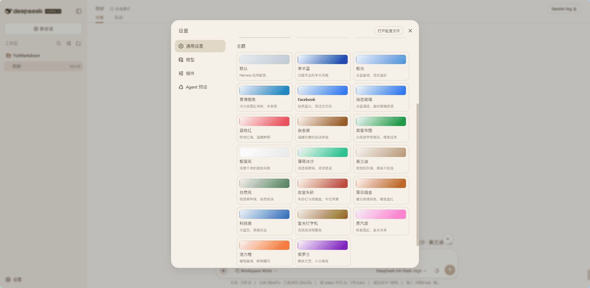

<div align="center">

# 🎨 DeepSeek Harness Yizi Themes

**19 个精品风格主题 + 自定义品牌 for [DeepSeek Harness](https://github.com/deepseek-ai/deepseek-harness) Web UI**

完整移植自 [YiziMarkdown](https://github.com/laoduu/YiziMarkdown) 的设计语言，
为 Harness 的 `--dsw-alias-*` 语义 token 体系量身定制。

**学术蓝 · 极光 · 赛博朋克 · Facebook · 液态玻璃 · 荔枝红 · 杂志感 · 黑客帝国 · 极简风 · 薄荷冰沙 · 莫兰迪 · 自然风 · 故宫朱砂 · 落日熔金 · 科技感 · 复古打字机 · 蒸汽波 · 活力橙 · 紫罗兰**

每个主题都同时支持 **亮色 / 深色** 两套配色，并跟随你的「浅色 / 深色 / 跟随系统」设置。

标准 **Cordis 插件**：`dsh plugin` 一键安装，不改动 Harness 源码。

[English](README.en.md) · [安装教程](#-安装教程) · [自定义品牌](#-自定义品牌) · [版本日志](CHANGELOG.md) · [开发日志](docs/DEVLOG.md) · [Agent 安装指引](docs/AGENT-SKILL.md)

</div>

---

## ✨ 特色

- 🎭 **19 个主题**：从极光流光到赛博朋克霓虹，从莫兰迪高级灰到故宫朱砂，总有一款配得上你的审美
- 🌗 **双模式**：每个主题都有精心调配的亮色 / 深色两套 token，跟随系统自动切换
- 🧩 **标准插件**：标准 Cordis 插件（`dsh plugin` 安装/卸载），不修改 Harness 仓库任何源码
- 🎚️ **正交双维度**：明暗模式与风格主题完全独立，可自由组合
- 🖌️ **自定义品牌**：左上角 Logo / 品牌字样 / 徽章 / 新会话标题全部可自定义，**颜色自动跟随主题与明暗**
- 🔤 **品牌映射**：输出时把提示词里的 "DeepSeek / 深度求索 / Harness" 替换为你设定的品牌词
- 📍 **随处可切换**：会话头部右上角 + 新会话（无对话）时的浮动按钮

---

## 🖼️ 主题预览



| 主题 | 亮色基调 | 深色基调 | 设计语言 |
|---|---|---|---|
| **学术蓝** `academic` | 淡蓝白 `#f5f8ff` | 深蓝黑 `#0d1117` | #002FA7 深蓝品牌，沉稳专业 |
| **极光** `aurora` | 冰蓝 `#f0f5fa` | 深墨 `#0a0e1a` | 北极光流动的色彩 |
| **赛博朋克** `cyberpunk` | 冷白 `#f0f4f8` | 深黑 `#050508` | 霓虹青粉撞色，未来感 |
| **Facebook** `facebook` | 灰白 `#f0f2f5` | 深灰 `#18191a` | #1877F2 品牌蓝，社交卡片风 |
| **液态玻璃** `liquidglass` | 冰晶白 `#f6f9fe` | 深靛 `#0c1222` | 半透明玻璃质感 |
| **荔枝红** `lychee` | 淡红白 `#fff5f5` | 暗红黑 `#171212` | #E63946 热情红调 |
| **杂志感** `magazine` | 暖纸 `#faf8f5` | 深褐 `#1a1612` | 咖啡棕衬线阅读 |
| **黑客帝国** `matrix` | 白底 `#f5faf5` | 纯黑 `#000000` | 矩阵绿终端风 |
| **极简风** `minimal` | 纯白 `#ffffff` | 深灰 `#1a1a1a` | 清爽原始 |
| **薄荷冰沙** `mint` | 奶白 `#f5fbf8` | 深绿 `#0a1a14` | #10B981 清透薄荷 |
| **莫兰迪** `morandi` | 米白 `#f7f3ef` | 深褐 `#2c2926` | 低饱和高级灰 |
| **自然风** `nature` | 米黄纸 `#f5f2eb` | 深墨绿 `#1a1f1a` | 纸感森林绿 |
| **故宫朱砂** `palace` | 宣纸 `#faf6f0` | 深墨 `#201812` | 朱砂红 + 琉璃金 |
| **落日熔金** `sunset` | 暖白 `#fef8f0` | 深紫 `#0d0812` | 琥珀色暮光 |
| **科技感** `tech` | 冷蓝白 `#f0f4f8` | GitHub 深 `#0d1117` | 经典开发工具风 |
| **复古打字机** `typewriter` | 老纸 `#f5f0e8` | 深灰 `#1a1a18` | 深褐墨色书房 |
| **蒸汽波** `vaporwave` | 浅粉紫 `#f8f0f6` | 深紫黑 `#140a1e` | 粉紫霓虹复古未来 |
| **活力橙** `vibrant` | 暖橙白 `#fff8f2` | 深褐 `#1a1410` | #F3641E 鲜明醒目 |
| **紫罗兰** `violet` | 淡紫白 `#faf5fe` | 深紫黑 `#16101f` | #7209B7 雅致文艺 |

---

## 📦 安装教程

> **前置条件**：一个能运行 `pnpm dsh web` 的 DeepSeek Harness 仓库（含 profile）。

### 方式一：从 GitHub Release 下载 tgz（推荐）

1. 下载 `dsh-yizi-themes-0.2.0.tgz` —— 在 [Releases 页面](https://github.com/laoduu/DeepSeek-Harness-yizi-themes/releases) 点击下载，或直接命令行拉取：

```bash
curl -L -o dsh-yizi-themes-0.2.0.tgz https://github.com/laoduu/DeepSeek-Harness-yizi-themes/releases/download/v0.2.0/dsh-yizi-themes-0.2.0.tgz
```

2. 停掉正在运行的 `dsh web`（Ctrl+C）；
3. 安装：

```bash
cd <你的 deepseek-harness 路径>
pnpm dsh plugin --profile web add /path/to/dsh-yizi-themes-0.2.0.tgz
```

4. 重启：

```bash
pnpm dsh web
```

### 方式二：从源码构建

```bash
# 克隆插件源码
git clone https://github.com/laoduu/DeepSeek-Harness-yizi-themes.git
cd DeepSeek-Harness-yizi-themes

# 构建并打包（prepare.mjs 从 Harness 仓库的 node_modules 解析 tsdown）
node prepare.mjs
npm pack          # 产出 dsh-yizi-themes-<version>.tgz
```

然后按方式一的 2-4 步安装、重启。

### ⚠️ 更新已有安装（同版本陷阱）

**同版本 tgz 内容变了，直接 `add` 不会更新**（pnpm 报 `Already up to date`）。

- 版本号**变了**：直接 `add` 即可；
- 版本号**没变**：必须先卸载再安装：

```bash
pnpm dsh plugin --profile web remove dsh-yizi-themes
pnpm dsh plugin --profile web add  /path/to/dsh-yizi-themes-<version>.tgz
```

### 使用

- **切换主题 / 明暗**：右上角调色板按钮 + 明暗切换按钮（会话头部）；新会话（无对话内容）时以浮动按钮显示在同一位置；
- **自定义品牌**：设置 → 外观 → 自定义（见下节）。

---

## 🖌️ 自定义品牌

设置 → 外观 → **自定义** 板块：

| 设置项 | 说明 |
|---|---|
| **Logo SVG** | 粘贴 SVG 代码或 data URI。用于**左上角品牌、收起侧边栏图标、新会话页图标**三处。留空用内置鲸鱼标 |
| **品牌字样** | 左上角品牌文字（默认 `DEEPSEEK`，18px） |
| **徽章字样** | 品牌文字旁的徽章标签（默认 `HARNESS`） |
| **新会话标题** | 新会话页标题文案（默认 `探索未至之境`） |
| **品牌映射** | 开关 + 映射表：输出时替换提示词里的 "DeepSeek Harness / DeepSeek / 深度求索 / Harness" |

**颜色自动跟随主题**：品牌字样、徽章背景、Logo 容器颜色统一使用 `--dsw-alias-brand-primary`，
切换任意风格主题或明暗模式时自动变化。

> **想让自己的 SVG 也跟随主题？** 把 SVG 里的硬编码颜色替换为：
> - `fill="var(--dsw-alias-brand-primary)"` —— 随主题与明暗自动切换；
> - `fill="currentColor"` —— 继承容器颜色（容器已设为主题色）。
>
> 其他可用变量：主文字 `--dsw-alias-label-primary`、次要文字 `--dsw-alias-label-secondary` /
> `--dsw-alias-label-caption`、反色文字 `--dsw-alias-label-primary-inverted`、
> 背景 `--dsw-alias-bg-layer-1`、边框 `--dsw-alias-border-l1` 等。

**持久化**：所有品牌设置保存在 `$DSH_HOME/settings.yaml` 的 `ui-theme.customBrand` 分节，
与主题偏好一起持久化，重启不丢失。

---

## ⚙️ 配置（cordis.patch.yml）

插件行的默认配置（可在 profile 的 `cordis.patch.yml` 里覆盖）：

| 字段 | 默认值 | 说明 |
|---|---|---|
| `wordmark` | `DEEPSEEK` | 品牌字样 |
| `wordmarkBadge` | `HARNESS` | 徽章字样 |
| `headline` | `探索未至之境` | 新会话标题 |
| `mappingEnabled` | `false` | 是否启用品牌映射 |
| `mappingDeepSeek` / `mappingDeepSeekChinese` / `mappingHarness` / `mappingDeepSeekHarness` | 原文 | 各品牌词的替换目标 |

设置页的修改优先级高于此配置（配置作为 base 层，用户层覆盖之）。

---

## 🗑️ 卸载

```bash
cd <你的 deepseek-harness 路径>
pnpm dsh plugin --profile web remove dsh-yizi-themes
```

重启 `dsh web` 即恢复默认外观。`settings.yaml` 里的 `ui-theme.customBrand` 属于核心命名空间，
卸载后仍保留（无副作用，可手工删除）。

---

## ❓ 常见问题

**Q: 更新后界面没变化？**
版本号没变则必须 `remove → add`（见上）；并完全重启 `dsh web`（Ctrl+C 后重启）+ 浏览器强刷 Ctrl+Shift+R。

**Q: 设置能输入但刷新后丢失？**
检查 `$DSH_HOME/settings.yaml` 是否出现 `ui-theme.customBrand`。若没有，看浏览器 F12 → Network →
`settings.mutate` 是否返回 `settings-not-exposed`（说明写入被拒）。插件数据走核心 `ui-theme` 命名空间（api-proxy 白名单），不要改成自定义命名空间。

**Q: 切换主题后左上角品牌颜色不变？**
确认 Logo/品牌字样已设置且为 `currentColor` 或 `var(--dsw-alias-brand-primary)`；硬编码颜色不会跟随主题。

**Q: 侧边栏折叠后重新展开空白？**
老版本 bug，升级到 0.2.0+。

**Q: 想让 agent 帮我装插件？**
把 [Agent 安装指引](docs/AGENT-SKILL.md) 交给 agent 即可。

---

## 🤝 贡献

欢迎提交 Pull Request：

- **新主题**：见 [开发日志](docs/DEVLOG.md) 与 `scripts/gen-themes.mjs`（CSS → TS 生成器）；
- **Bug 修复**：Harness 版本更新导致的适配问题；
- **文档改进**：安装教程、常见问题。

---

## 📄 文档

- [版本日志](CHANGELOG.md)
- [开发日志](docs/DEVLOG.md)
- [Agent 安装指引](docs/AGENT-SKILL.md)

---

## ⚖️ 许可

[MIT](LICENSE) © [老独](https://github.com/laoduu)

本项目是对 [DeepSeek Harness](https://github.com/deepseek-ai/deepseek-harness)（MIT）的第三方主题扩展；
主题设计语言移植自 [YiziMarkdown](https://github.com/laoduu/YiziMarkdown)。

> 旧版 `install.sh` / `install.ps1` / `MANIFEST.json` / `patch/` 为早期"源码覆盖"方案遗留，
> 已废弃，仅保留作参考，请勿使用。

---

<div align="center">

> A third-party `dsh-plugin` that brings 19 YiziMarkdown themes to DeepSeek Harness.

**如果这个项目对你有帮助，欢迎 ⭐ Star 支持！**

</div>
